# Documentação do Agente

## Caso de Uso

### Problema
> Qual problema financeiro seu agente resolve?

Muitos usuários têm dificuldade em entender sua situação financeira, controlar gastos e tomar decisões adequadas de investimento.
Além disso, soluções tradicionais são reativas, genéricas e não consideram o contexto individual do cliente.

### Solução
> Como o agente resolve esse problema de forma proativa?

O agente financeiro atua de forma personalizada, analisando dados do cliente (transações, perfil e histórico) para:

Identificar padrões de gastos

Sugerir melhorias no comportamento financeiro

Recomendar produtos adequados ao perfil

Para fazer cálculos de simulação de rendimento dos produtos financeiros são utilizadas taxas simuladas aproximadas, baseadas em cenários realistas, utilizadas apenas para fins ilustrativos. Essa abordagem evita dependência de dados externos e reduz o risco de gerar informações imprecisas.

O agente utiliza IA generativa com base em dados estruturados para fornecer respostas claras, seguras e contextualizadas.

### Público-Alvo
> Quem vai usar esse agente?

Pessoas que desejam melhorar sua organização financeira

Iniciantes em investimentos

Usuários que buscam orientação personalizada

Clientes com renda fixa que desejam atingir metas financeiras

---

## Persona e Tom de Voz

### Nome do Agente

FinAssist (Assistente de Saúde Financeira)

### Personalidade
> Como o agente se comporta? 

O agente possui um comportamento:

Consultivo

Educativo

### Tom de Comunicação
> Formal, informal, técnico, acessível?
 Levemente informal

 Didático

### Exemplos de Linguagem
- Saudação: "Olá! Vou analisar suas informações financeiras para te ajudar da melhor forma possível."
- Confirmação: "Entendi! Vou verificar seus dados e te dar uma sugestão personalizada."
- Erro/Limitação: "Não encontrei essa informação nos seus dados atuais, mas posso te ajudar com base no que tenho disponível."

---

## Arquitetura

### Diagrama

```mermaid
    flowchart TD
        A[Cliente] --> B[Interface Streamlit]
        B --> C{Backend: Classificador de Intenção}
        C -- Intenção conhecida --> D[Função Específica]
        D --> E[Base de Conhecimento]
        E --> D
        D --> F[Geração de Resposta Bruta]
        F --> G[LLM - Melhoria de Texto]
        C -- Fallback --> H[LLM - Resposta Direta]
        G --> I[Resposta Final]
        H --> I
        I --> B
```

### Componentes

| Componente | Descrição |
|------------|-----------|
| Interface | Chatbot em Streamlit |
| LLM | [ex: gpt-4o-mini via API] |
| Base de Conhecimento | JSON/CSV com dados do cliente |
| Validação | Validação: Combinação de lógica determinística (cálculos baseados exclusivamente na base de dados) e regras restritivas no system prompt para evitar que o LLM gere informações não verificáveis. |

---

## Segurança e Anti-Alucinação

### Estratégias Adotadas

- [ ] O agente responde apenas com base nos dados fornecidos (CSV e JSON)
- [ ] Não inventa valores ou informações financeiras
- [ ] Recomenda apenas produtos existentes na base de dados
- [ ] Utiliza o perfil do cliente para validar sugestões
- [ ] Quando não há dados suficientes, informa claramente a limitação

### Limitações Declaradas
O agente não:

- Acessa dados em tempo real, pois só trabalha com dados já carregados no sistema

- Substitui um consultor financeiro profissional

- Faz previsões de mercado

- Garante rentabilidade de investimentos

- Responde fora do escopo dos dados fornecidos

- Armazena dados sensíveis reais (utiliza apenas dados mockados)